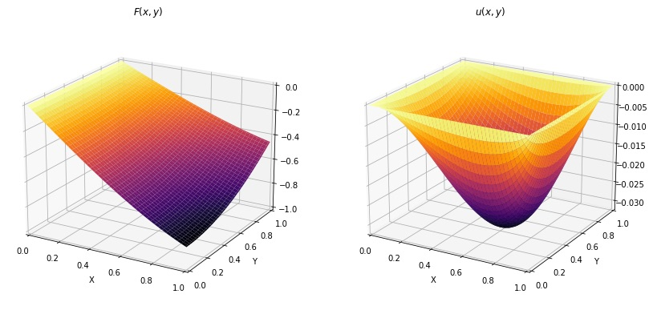
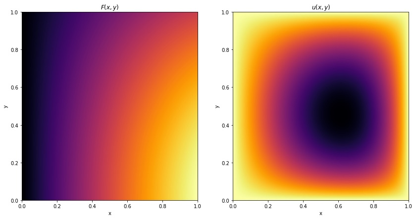

# Numerical methods for Partial Differential Equations with Python

_Gilbert François Duivesteijn_

## About

This repository is a collection of Jupyter Notebooks, containing methods for solving different types of PDEs, using Numpy and SciPy. Most notebooks take a special case of the general convection-diffusion equation

and use a specific method to solve it using a most suitable numerical method. With time, more and more notebooks will be added.
|    |                               |
| ------------------------------------------------- | ----------------------------- |
|                      |  |
_Figure 1: Example of numerical solution of a 2D Poisson PDE_ 

## Table of contents

### Finite difference

[1D heat equation, finite difference, SciPy integration](./1D%20heat%20equation%2C%20finite%20difference%2C%20SciPy%20integration.ipynb)

[1D heat equation, finite difference, direct method](./1D%20heat%20equation%2C%20finite%20difference%2C%20direct%20method.ipynb)

[1D heat equation, finite difference, forward Euler](./1D%20heat%20equation%2C%20finite%20difference%2C%20forward%20Euler.ipynb)

[1D heat equation, finite difference, Neumann BC](./1D%20heat%20equation%2C%20finite%20difference%2C%20Neumann%20BC.ipynb)

[1D heat equation, finite difference, p1 MIT 2016](./1D%20heat%20equation%2C%20finite%20difference%2C%20p1%20MIT%202016.ipynb)

[1D convection equation, finite difference, SciPy integration](./1D%20convection%20equation%2C%20finite%20difference%2C%20SciPy%20integration.ipynb)

[1D wave equation, finite difference, SciPy integration](./1D%20wave%20equation%2C%20finite%20difference%2C%20SciPy%20integration.ipynb)

[2D Poisson equation, finite difference](./2D%20Poisson%20equation%2C%20finite%20difference.ipynb)

[2D Poisson equation, finite difference, BC](./2D%20Poisson%20equation%2C%20finite%20difference%2C%20BC.ipynb)

## 1D Finite volume

[1D Burger's equation, finite volume](./1D%20Burger%27s%20equation%2C%20finite%20volume.ipynb)

### 1D ODE

[Solving ODE with SciPy](./Solving%20ODE%20with%20SciPy.ipynb)

### Miscellaneous

[Euler's formula and Euler's Identity](./Euler%27s%20formula%20and%20Euler%27s%20Identity.ipynb)

[Taylor expansion](./Taylor%20expansion.ipynb)

[Truncation error analysis with Taylor expansions](./Truncation%20error%20analysis%20with%20Taylor%20expansions.ipynb)

