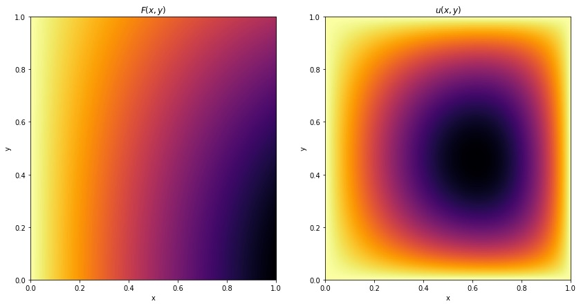

# Numerical methods for Partial Differential Equations with Python

_Gilbert François Duivesteijn_

## About

This repository is a collection of Jupyter Notebooks, containing methods for solving different types of PDEs, using Numpy and SciPy. Most notebooks take a special case of the general convection-diffusion equation

and use a specific method to solve it using a most suitable numerical method. With time, more and more notebooks will be added.
| Example of numerical solution of a 2D Poisson PDE |                               |
| ------------------------------------------------- | ----------------------------- |
|                      |  |

## Table of contents

### 1D PDE

[1D Heat equation, Finite Difference, Direct Method](./1D%20Heat%20equation%2C%20Finite%20Difference%2C%20Direct%20Method.ipynb)

[1D Heat equation, Finite Difference, Euler method](./1D%20Heat%20equation%2C%20Finite%20Difference%2C%20Euler%20method.ipynb)

[1D Heat equation, Finite Difference, Neumann BC](./1D%20Heat%20equation%2C%20Finite%20Difference%2C%20Neumann%20BC.ipynb)

[1D Heat equation, Finite Difference, SciPy method](./1D%20Heat%20equation%2C%20Finite%20Difference%2C%20SciPy%20method.ipynb)

[1D Heat equation, Finite Difference, p1 MIT 2016](./1D%20Heat%20equation%2C%20Finite%20Difference%2C%20p1%20MIT%202016.ipynb)

### 2D PDE

[2D Poisson equation, Finite Difference](./2D%20Poisson%20equation%2C%20Finite%20Difference.ipynb)

### 1D ODE

[Solving ODE with SciPy](./Solving%20ODE%20with%20SciPy.ipynb)

### Miscellaneous

[Taylor expansion](./Taylor%20expansion.ipynb)

[Truncation error analysis with Taylor expansions](./Truncation%20error%20analysis%20with%20Taylor%20expansions.ipynb)
